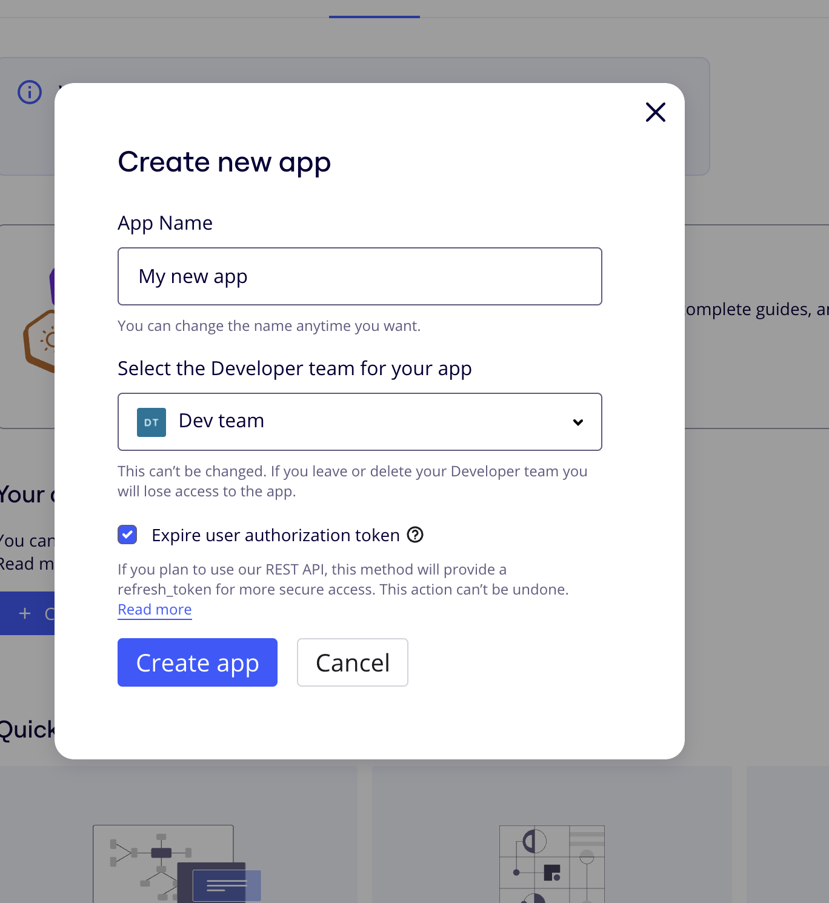
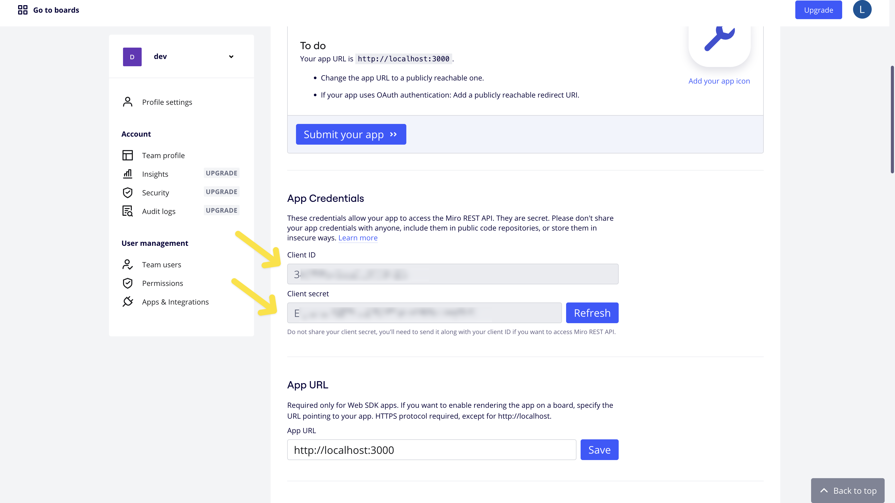

# Table of Contents

-   [Table of Contents](#table-of-contents)
    -   [Setting Up the Local Instance of the Module](#setting-up-the-local-instance-of-the-module)
        -   [Clone the GitHub Repository](#clone-the-github-repository)
        -   [Switch to the `miro-module` Branch](#switch-to-the-miro-module-branch)
        -   [Install Dependencies](#install-dependencies)
        -   [Obtain Miro Client Credentials](#obtain-miro-client-credentials)
        -   [Set Up Environment Variables](#set-up-environment-variables)
        -   [Run Tests](#run-tests)
        -   [Prepare to Use Your Module in Your Local Frigg Instance](#prepare-to-use-your-module-in-your-local-frigg-instance)
    -   [Running Your Local Frigg Instance](#running-your-local-frigg-instance)
        -   [Initialization](#initialization)
        -   [Adding the Miro Integration](#adding-the-miro-integration)
        -   [Example Methods from the Miro Integration](#example-methods-from-the-miro-integration)
        -   [Running the Application](#running-the-application)

## Setting Up the Local Instance of the Module

Follow these steps to set up your local instance of the `@friggframework/api-module-miro` module:

### Clone the GitHub Repository

```
git clone https://github.com/lunchpaillola/api-module-library.git

```

### Switch to the `miro-module` Branch

```
git checkout miro-module

```

### Install Dependencies

Ensure you are using Node.js version ≥18 and npm version ≥9. Then, install the dependencies in the root directory:

```
npm install

```

```
npm install --workspace=packages/miro

```

### Obtain Miro Client Credentials

1. **Create a Developer Team in Miro:**
    - If you don't have a Miro account yet, [sign up to Miro](https://miro.com/signup/). If you already have a Miro account, [sign in to it](https://miro.com/login/).
    - After signing in, click the link to [create a Developer team for your currently active Miro account](https://miro.com/app/dashboard/?createDevTeam=1).
2. **Create an App in the Developer Hub:**

    - Go to the [Developer Hub](https://developers.miro.com/page/developer-hub#your-apps) and create a new app.
    - Give your app a name, select the developer team for your app, and check the "Expire user authorization token" option.

    

3. **Configure the Redirect URI and Permissions:**
    - Set the Redirect URI for OAuth 2.0 to `http://localhost:3000/redirect/miro`.
    - For permissions, select `boards:read` , `boards:write` `identity:read`, `identity:write`, `team:read`, `team:write`

### Set Up Environment Variables

1. **Navigate to the `packages/miro` Directory:**

    ```
    cd packages/miro

    ```

2. **Copy the Sample Environment Variables File:**

    ```
    cp .env.example .env

    ```

3. **Edit the `.env` File:**

Copy your `Client ID` and `Client secret` into the `.env` file:


        ```
        MIRO_CLIENT_ID=<your-client-id>
        MIRO_CLIENT_SECRET=<your-client-secret>
        REDIRECT_URI=http://localhost:3000/redirect

        ```

### Run Tests

Navigate back to the root directory

```
cd ../../
```

1. **Run the API Tests:**

    ```
    npm run test:api --workspace=packages/miro

    ```

2. **Run the Auther Tests:**

    ```
    npm run test:auther --workspace=packages/miro

    ```

### Prepare to Use Your Module in Your Local Frigg Instance

1. **Navigate to the `packages/miro` Directory:**

    ```
    cd packages/miro

    ```

2. **Link the Package:**

    ```
    npm link

    ```

## Running Your Local Frigg Instance

### Initialization

1. Run the following command:

    ```bash
    npx create-frigg-app {{enter-your-desired-app-name}}

    ```

2. Create a MongoDB instance either locally or on MongoDB Atlas. This will be your data store for development.
3. Open the `dev.json` config file located in the `/src/configs/` directory. This file will be read by the backend (run by `serverless offline`) to load up process.ENV.
4. Add the connection string to the `MONGO_URI` config variable.
5. Add `MIRO_CLIENT_ID` and `MIRO_CLIENT_SECRET` to the config file:

    ```json
    {
        "MIRO_CLIENT_ID": "<your client id>",
        "MIRO_CLIENT_SECRET": "<your client secret>"
    }
    ```

6. Run the following command to link the module:

    ```bash
    npm link @friggframework/api-module-miro

    ```

### Adding the Miro Integration

1. Create a new `MiroIntegration.js` file in `/src/integrations/`. You can copy the content from `HubspotIntegration.js` and update it for Miro. Here’s an example: [MiroIntegration.js](https://github.com/lunchpaillola/lola-integrations/blob/master/backend/src/integrations/MiroIntegration.js).
2. Import and add the Miro integration to `backend/backend.js`.

### Example Methods from the Miro Integration

To learn more about the example methods, you can view this [Postman collection](https://lunchpaillabs.postman.co/workspace/Team-Workspace~52d73b64-7d65-4014-8b3e-2ce5108ed028/collection/12568298-7148dd35-ca2f-4ba8-9d12-8e0d22f5fae0).

**createBoard**

```jsx
async createBoard(boardName, boardDescription) {
    try {
        const res = await this.target.api.createBoard({
            name: boardName,
            description: boardDescription
        });

        const formatted = {
            id: res.id,
            name: res.name,
            description: res.description,
            createdBy: res.createdBy.name,
            createdAt: res.createdAt,
            modifiedBy: res.modifiedBy.name,
            modifiedAt: res.modifiedAt,
            owner: res.owner.name,
            viewLink: res.viewLink,
        };

        return { data: formatted };
    } catch (error) {
        console.error('Error creating board:', error);
        return { data: {}, error: error.message || 'An error occurred while creating the board' };
    }
}

```

**Sample response**

```jsx
{
    "id": "uXjVK21Sn_M=",
    "type": "board",
    "name": "mirehuddle",
    "description": "a newboard",
    "links": {
        "self": "https://api.miro.com/v2/boards/uXjVK21Sn_M%3D",
        "related": "https://api.miro.com/v2/boards/uXjVK21Sn_M%3D/members?limit=20&offset=0"
    },
    "createdAt": "2024-07-01T16:54:26Z",
    "createdBy": {
        "id": "3074457348895682474",
        "type": "user",
        "name": "Lola Ojabowale"
    },
    "currentUserMembership": {
        "id": "3074457348895682474",
        "type": "board_member",
        "name": "Lola Ojabowale",
        "role": "owner"
    },
    "modifiedAt": "2024-07-01T16:54:26Z",
    "modifiedBy": {
        "id": "3074457348895682474",
        "type": "user",
        "name": "Lola Ojabowale"
    },
    "owner": {
        "id": "3074457348895682474",
        "type": "user",
        "name": "Lola Ojabowale"
    },
    "permissionsPolicy": {
        "collaborationToolsStartAccess": "all_editors",
        "copyAccess": "team_editors",
        "copyAccessLevel": "team_editors",
        "sharingAccess": "team_members_with_editing_rights"
    },
    "policy": {
        "permissionsPolicy": {
            "collaborationToolsStartAccess": "all_editors",
            "copyAccess": "team_editors",
            "copyAccessLevel": "team_editors",
            "sharingAccess": "team_members_with_editing_rights"
        },
        "sharingPolicy": {
            "access": "private",
            "inviteToAccountAndBoardLinkAccess": "no_access",
            "organizationAccess": "private",
            "teamAccess": "private"
        }
    },
    "sharingPolicy": {
        "access": "private",
        "inviteToAccountAndBoardLinkAccess": "no_access",
        "organizationAccess": "private",
        "teamAccess": "private"
    },
    "team": {
        "id": "3458764593275814084",
        "type": "team",
        "name": "Dev team"
    },
    "viewLink": "https://miro.com/app/board/uXjVK21Sn_M="
}
```

**getBoards**

```jsx
async getSampleData() {
        try {
            const res = await this.target.api.getBoards();
            const formatted = res.data.map((board) => ({
                id: board.id,
                name: board.name,
                description: board.description,
                createdBy: board.createdBy.name,
                createdAt: board.createdAt,
                modifiedBy: board.modifiedBy.name,
                modifiedAt: board.modifiedAt,
                owner: board.owner.name,
                viewLink: board.viewLink,
            }));
            return { data: formatted };
        } catch (error) {
            console.error('Error fetching sample data:', error);
            return { data: [], error: error.message || 'An error occurred' };
        }
    }
```

**Sample response**

```json
{
    "size": 2,
    "offset": 0,
    "limit": 2,
    "total": 56,
    "data": [
        {
            "id": "uXjVK21fJMM=",
            "type": "board",
            "name": "newboard",
            "description": "a newboard",
            "links": {
                "self": "https://api.miro.com/v2/boards/uXjVK21fJMM%3D",
                "related": "https://api.miro.com/v2/boards/uXjVK21fJMM%3D/members?limit=20&offset=0"
            },
            "createdAt": "2024-07-01T17:02:12Z",
            "createdBy": {
                "id": "3074457348895682474",
                "type": "user",
                "name": "Lola Ojabowale"
            },
            "currentUserMembership": {
                "id": "3074457348895682474",
                "type": "board_member",
                "name": "Lola Ojabowale",
                "role": "owner"
            },
            "modifiedAt": "2024-07-01T17:02:12Z",
            "modifiedBy": {
                "id": "3074457348895682474",
                "type": "user",
                "name": "Lola Ojabowale"
            },
            "owner": {
                "id": "3074457348895682474",
                "type": "user",
                "name": "Lola Ojabowale"
            },
            "permissionsPolicy": {
                "collaborationToolsStartAccess": "all_editors",
                "copyAccess": "team_editors",
                "copyAccessLevel": "team_editors",
                "sharingAccess": "team_members_with_editing_rights"
            },
            "policy": {
                "permissionsPolicy": {
                    "collaborationToolsStartAccess": "all_editors",
                    "copyAccess": "team_editors",
                    "copyAccessLevel": "team_editors",
                    "sharingAccess": "team_members_with_editing_rights"
                },
                "sharingPolicy": {
                    "access": "private",
                    "inviteToAccountAndBoardLinkAccess": "no_access",
                    "organizationAccess": "private",
                    "teamAccess": "private"
                }
            },
            "sharingPolicy": {
                "access": "private",
                "inviteToAccountAndBoardLinkAccess": "no_access",
                "organizationAccess": "private",
                "teamAccess": "private"
            },
            "team": {
                "id": "3458764593275814084",
                "type": "team",
                "name": "Dev team"
            },
            "viewLink": "https://miro.com/app/board/uXjVK21fJMM="
        },
        {
            "id": "uXjVK21aFGc=",
            "type": "board",
            "name": "mirehuddle",
            "description": "a newboard",
            "links": {
                "self": "https://api.miro.com/v2/boards/uXjVK21aFGc%3D",
                "related": "https://api.miro.com/v2/boards/uXjVK21aFGc%3D/members?limit=20&offset=0"
            },
            "createdAt": "2024-07-01T17:00:11Z",
            "createdBy": {
                "id": "3074457348895682474",
                "type": "user",
                "name": "Lola Ojabowale"
            },
            "currentUserMembership": {
                "id": "3074457348895682474",
                "type": "board_member",
                "name": "Lola Ojabowale",
                "role": "owner"
            },
            "modifiedAt": "2024-07-01T17:00:11Z",
            "modifiedBy": {
                "id": "3074457348895682474",
                "type": "user",
                "name": "Lola Ojabowale"
            },
            "owner": {
                "id": "3074457348895682474",
                "type": "user",
                "name": "Lola Ojabowale"
            },
            "permissionsPolicy": {
                "collaborationToolsStartAccess": "all_editors",
                "copyAccess": "team_editors",
                "copyAccessLevel": "team_editors",
                "sharingAccess": "team_members_with_editing_rights"
            },
            "policy": {
                "permissionsPolicy": {
                    "collaborationToolsStartAccess": "all_editors",
                    "copyAccess": "team_editors",
                    "copyAccessLevel": "team_editors",
                    "sharingAccess": "team_members_with_editing_rights"
                },
                "sharingPolicy": {
                    "access": "private",
                    "inviteToAccountAndBoardLinkAccess": "no_access",
                    "organizationAccess": "private",
                    "teamAccess": "private"
                }
            },
            "sharingPolicy": {
                "access": "private",
                "inviteToAccountAndBoardLinkAccess": "no_access",
                "organizationAccess": "private",
                "teamAccess": "private"
            },
            "team": {
                "id": "3458764593275814084",
                "type": "team",
                "name": "Dev team"
            },
            "viewLink": "https://miro.com/app/board/uXjVK21aFGc="
        }
    ],
    "links": {
        "self": "https://api.miro.com/v2/boards?team_id=3458764593275814084&limit=2&offset=0&sort=default",
        "next": "https://api.miro.com/v2/boards?team_id=3458764593275814084&limit=2&offset=2&sort=default",
        "last": "https://api.miro.com/v2/boards?team_id=3458764593275814084&limit=2&offset=54&sort=default"
    },
    "type": "list"
}
```

**getAllBoardMembers**

```jsx
async getAllBoardMembersFormatted(boardId) {

    try {
        const res = await this.target.api.getAllBoardMembers(boardId);

        const formatted = res.data.map((member) => ({
            id: member.id,
            name: member.name,
            role: member.role,
            email: member.email,
            joinedAt: member.createdAt,
        }));

        return { data: formatted };
    } catch (error) {
        console.error('Error fetching board members:', error);
        return { data: [], error: error.message || 'An error occurred while fetching board members' };
    }
}
```

**sampleResponse**

```json
{
    "size": 1,
    "offset": 0,
    "limit": 3,
    "total": 1,
    "data": [
        {
            "id": "3074457348895682474",
            "type": "board_member",
            "name": "Lola Ojabowale",
            "links": {
                "self": "https://api.miro.com/v2/boards/uXjVK34hohQ%3D/members/3074457348895682474"
            },
            "role": "owner"
        }
    ],
    "links": {
        "self": "https://api.miro.com/v2/boards/uXjVK34hohQ%3D/members?limit=3&offset=0"
    },
    "type": "list"
}
```

### Running the Application

1. If you have not already, select the "Create Demo User".
2. Log in as the Demo User.
3. You will see the Dashboard with Miro as an available connection.
4. Click "Connect" for Miro.
5. You should be redirected to Miro and prompted to authorize.
6. Complete the authorization flow.
7. Upon redirect, you should now see a connected Miro card.
8. Select "Get Sample Data" from the Miro app dropdown menu to see live data fetched from your test account.
