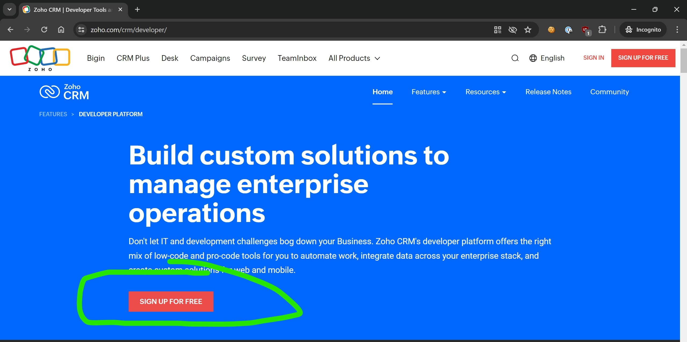
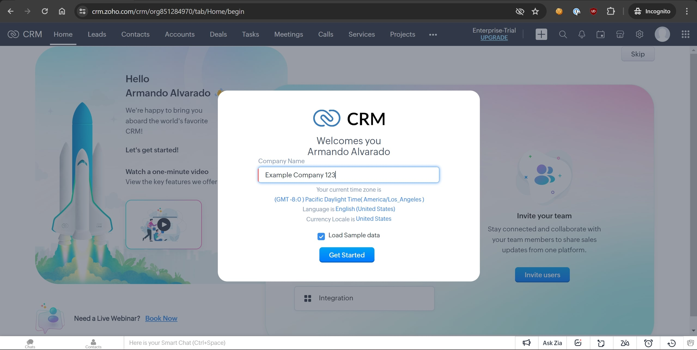
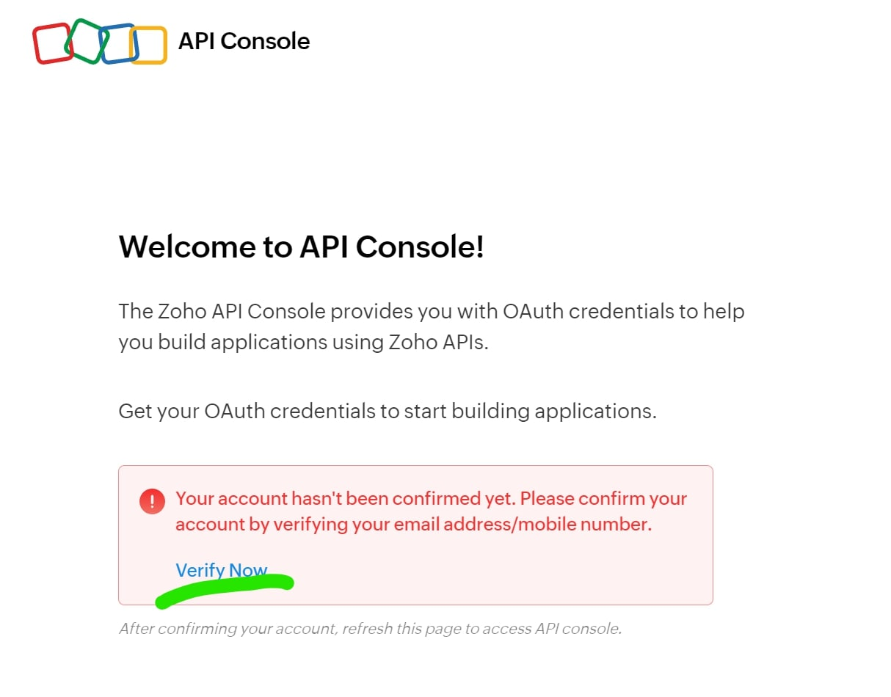
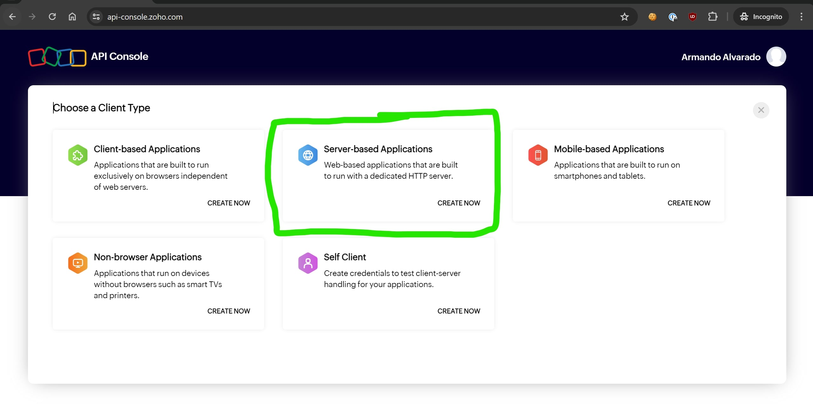
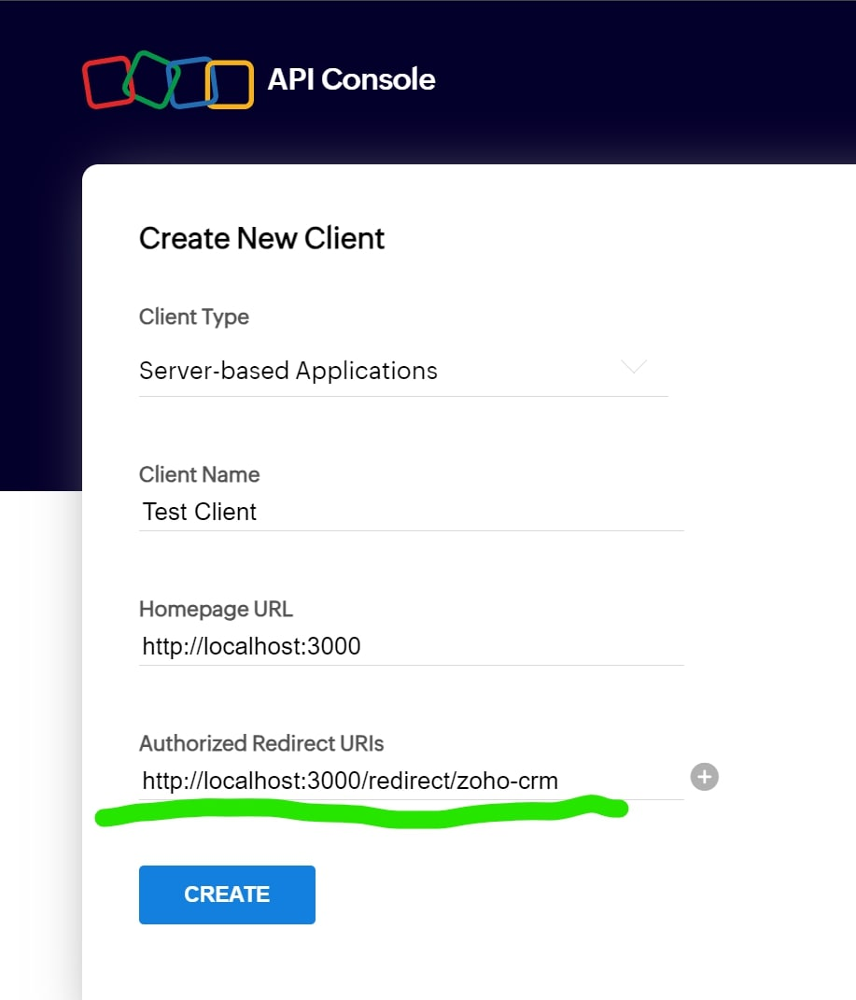
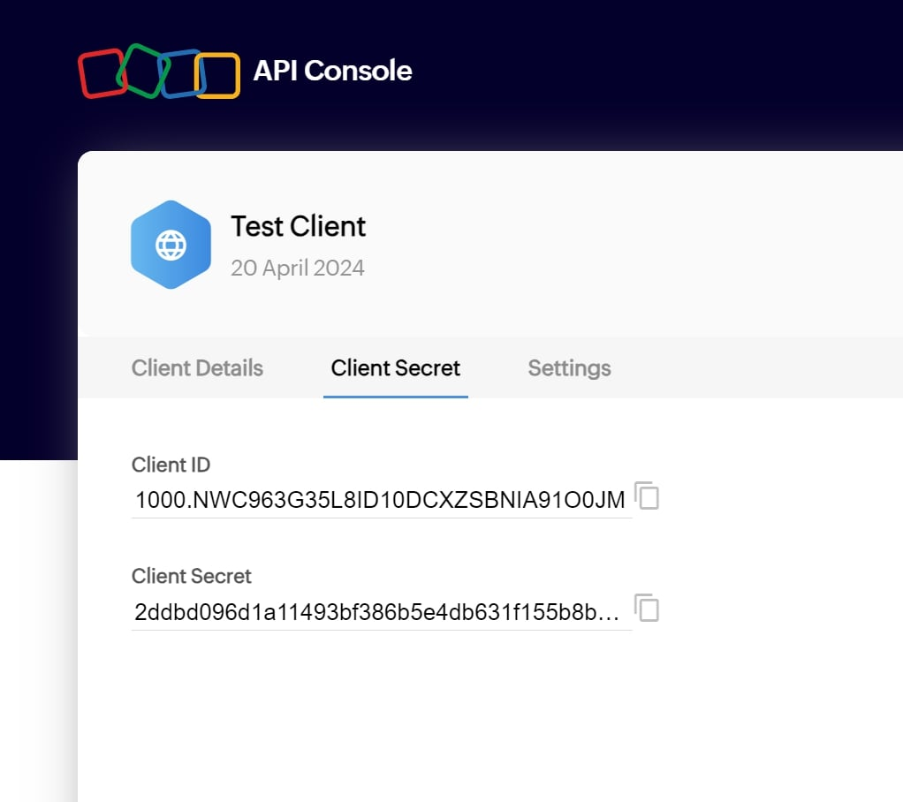
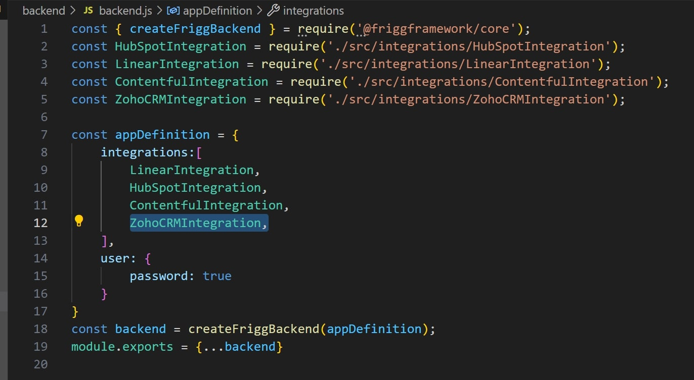
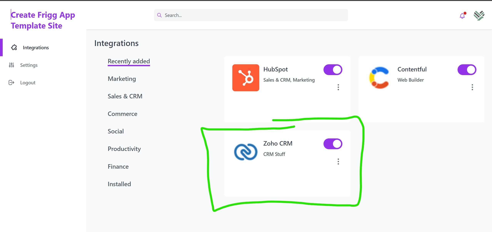
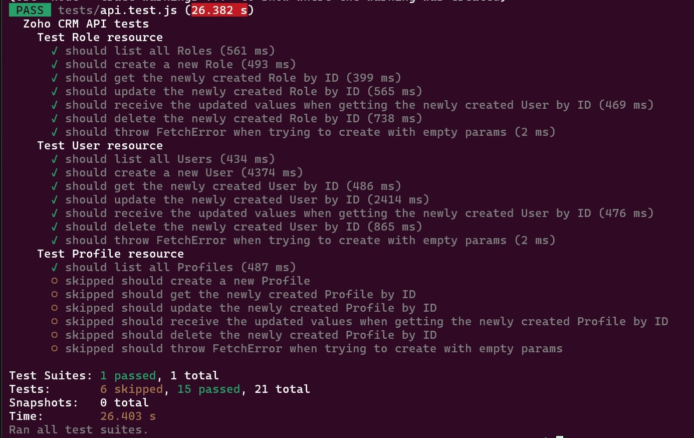

# Zoho CRM

This is the API Module for Zoho CRM that allows the [Frigg](https://friggframework.org) code to talk to the Zoho CRM API.

[Link to the Zoho CRM REST API Postman collection.](https://www.postman.com/zohocrmdevelopers/workspace/zoho-crm-developers/collection/8522016-0a15778a-ccb1-4676-98b7-4cf1fe7fc940?ctx=documentation)

Read more on the [Frigg documentation site](https://docs.friggframework.org/api-modules/list/zoho-crm


## Setup a Zoho CRM developer account 

In order to test this api module, you will need to populate your local `.env` file with a set of credentials (`ZOHO_CRM_CLIENT_ID` and `ZOHO_CRM_CLIENT_SECRET`).

To get those, you will need to sign up for a Zoho CRM developer account and [create a new API client](https://www.zoho.com/crm/developer/docs/api/v6/register-client.html), which is explained below.

If you've already done this, skip to the next section. 

1. Go to https://www.zoho.com/crm/developer/ and click `Sign Up For Free`



2. Once you're in, set up your example company. Check the `Load Sample Data` box.



3. Go to your account's API Console at https://api-console.zoho.com/.

    * You may be asked to verify your email address before accessing your API Console
    

    * You'll receive an email with a verification link
    


4. From your API Console, you are able to create client for your account. For our purposes, select `Server-based Applications`.



5. When filling in the details for your new client, make sure to use `http://localhost:3000/redirect/zoho-crm` in the `Authorized Redirect URIs` field.



6. After creating the client, you will be sent to the `Client Secret` tab where you can grab your Client ID and Client Secret.



## Set up your local `.env` file

1. Make a copy of `.env.example` and name it `.env`.


2. Grab your Client ID and Client Secret from the Zoho CRM API Console and paste them into your local `.env` file. It should look something like this:
    ```
    ZOHO_CRM_CLIENT_ID=your_client_id
    ZOHO_CRM_CLIENT_SECRET=your_client_secret
    ZOHO_CRM_SCOPE=ZohoCRM.users.ALL,ZohoCRM.org.ALL,ZohoCRM.settings.roles.ALL,ZohoCRM.settings.profiles.ALL
    REDIRECT_URI=http://localhost:3000/redirect
    ```


## Using the api module from the terminal

With your `.env` in place, you can now open a terminal to play around with the available APIs.

1. Start a `node` terminal in `packages/zoho-crm`

2. Paste the following code into the terminal:
    ```js
        require('dotenv').config();
        const {Authenticator} = require('@friggframework/test');
        const {Api} = require('./api.js');

        api = new Api({
            client_id: process.env.ZOHO_CRM_CLIENT_ID,
            client_secret: process.env.ZOHO_CRM_CLIENT_SECRET,
            scope: process.env.ZOHO_CRM_SCOPE,
            redirect_uri: `${process.env.REDIRECT_URI}/zoho-crm`,
        });

        const url = await api.getAuthUri();
        const response = await Authenticator.oauth2(url);
        const baseArr = response.base.split('/');
        response.entityType = baseArr[baseArr.length - 1];
        delete response.base;

        await api.getTokenFromCode(response.data.code);

        console.log('api ready!');

    ```

3. Your browser will open a tab and send you to Zoho CRM to authorize the client. You may need to log in first.
    


4. After authorizing, the tokens are returned to your terminal where they are used to create an authenticated instance of the Zoho CRM API module in the `api` variable. From here you can call any of the existing API resources defined in the module.
    * List existing Users:
        ```js
        > await api.listUsers()
        {
          users: [
            {
              country: 'HN',
              name_format__s: 'Salutation,First Name,Last Name',
              language: 'en_US',
              microsoft: false,
              '$shift_effective_from': null,
              id: '6238474000000461001',
              state: 'Francisco Morazan',
              fax: null,
              country_locale: 'en_US',
              sandboxDeveloper: false,
              zip: null,
              decimal_separator: 'Period',
              created_time: '2024-04-20T10:35:36-06:00',
              time_format: 'hh:mm a',
              offset: -21600000,
              profile: [Object],
              created_by: [Object],
              zuid: '851289894',
              full_name: 'Armando Alvarado',
              phone: '32415425',
              dob: null,
              sort_order_preference__s: 'First Name,Last Name',
              status: 'active',
              role: [Object],
              customize_info: [Object],
              city: null,
              signature: null,
              locale: 'en_US',
              personal_account: false,
              Source__s: null,
              Isonline: false,
              default_tab_group: '0',
              Modified_By: [Object],
              street: null,
              '$current_shift': null,
              alias: null,
              theme: [Object],
              first_name: 'Armando Alvarado',
              email: 'aaj2006@hotmail.com',
              status_reason__s: null,
              website: null,
              Modified_Time: '2024-04-20T10:37:55-06:00',
              '$next_shift': null,
              mobile: null,
              last_name: null,
              time_zone: 'America/Tegucigalpa',
              number_separator: 'Comma',
              confirm: true,
              date_format: 'MM-dd-yyyy',
              category: 'regular_user'
            }
          ]
        }
        ```

    * List existing Roles:
        ```js
        > await api.listRoles()
        {
          roles: [
            {
              display_label: 'CEO',
              created_by__s: null,
              modified_by__s: null,
              forecast_manager: null,
              share_with_peers: true,
              modified_time__s: null,
              name: 'CEO',
              description: 'Users with this role have access to   the data owned by all other users.',
              reporting_to: null,
              id: '6238474000000026005',
              created_time__s: null
            },
            {
              display_label: 'Manager',
              created_by__s: null,
              modified_by__s: null,
              forecast_manager: null,
              share_with_peers: false,
              modified_time__s: null,
              name: 'Manager',
              description: 'Users belonging to this role cannot   see data for admin users.',
              reporting_to: [Object],
              id: '6238474000000026008',
              created_time__s: null
            }
          ]
        }
        ```

## Using this API module in a Frigg instance
1. Run `npm install @friggframework/api-module-zoho-crm`

2. Populate your `.env` file with `ZOHO_CRM_CLIENT_ID`, `ZOHO_CRM_CLIENT_SECRET`, and `ZOHO_CRM_SCOPE`.

3. Create a subclass of `IntegrationBase` from `@friggframework/core` in `src/integrations` and plug in the Zoho CRM API module. Example:
    ```js
    const { IntegrationBase, Options } = require('@friggframework/core');
    const { Definition: ZohoCRMModule } = require('@friggframework/api-module-zoho-crm');
    const _ = require('lodash');

    class ZohoCRMIntegration extends IntegrationBase {
        static Config = {
            name: 'zoho-crm',
            version: '1.0.0',
            supportedVersions: ['1.0.0'],
            events: ['GET_SOMETHING'],
        };

        static Options =
            new Options({
                module: ZohoCRMModule,
                integrations: [ZohoCRMModule],
                display: {
                    name: 'Zoho CRM',
                    description: 'CRM Stuff',
                    category: 'CRM',
                    detailsUrl: 'https://www.zoho.com/crm/',
                    icon: 'https://static.zohocdn.com/crm/images/favicon_cbfca4856ba4bfb37be615b152f95251_.ico',
                }
            });

        static modules = {
            'zoho-crm': ZohoCRMModule
        }

        /**
        * HANDLE EVENTS
        */
        async receiveNotification(notifier, event, object = null) {
            if (event === 'GET_SOMETHING') {
                return this.target.api.getProjects();
            }
        }

        /**
        * ALL CUSTOM/OPTIONAL METHODS FOR AN INTEGRATION
        */
        async getSampleData() {
            const response = await this.target.api.listRoles();
            const data = response.roles.map(role => ({
                'Id': role.id,
                'Name': role.name,
                'Description': role.description,
            }));
            return {data};
        }
    }
    
    module.exports = ZohoCRMIntegration;
    ```

4. Plug your subclass into your app definition's `integrations` array. 


5. Zoho CRM should now appear in your list of available integrations



## Running the tests

The API tests verify that the usual CRUD operations against the API resources work as expected. Because of that, you will need to have a valid set of credentials in your local `.env` file.

When running `npm run test`, a browser tab will open to ask you for authorization. After you've authorized, the tests will run and produce an output similar to this:


**Note:** There is a 30-second timeout for the authorization request. You may need to try again if your browser does not open fast enough.